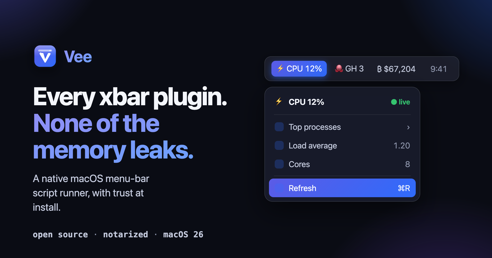
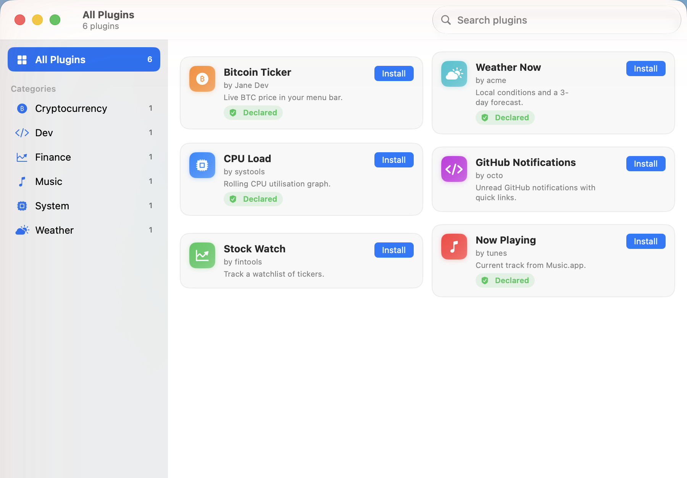
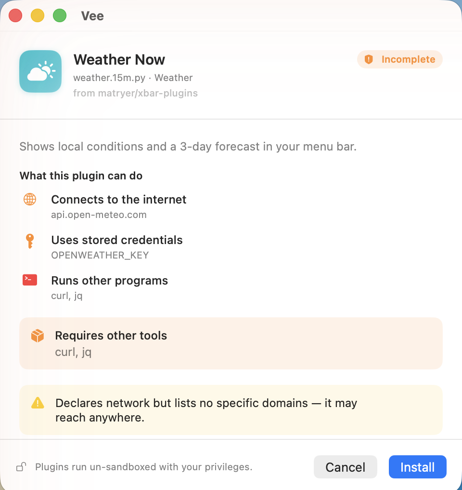
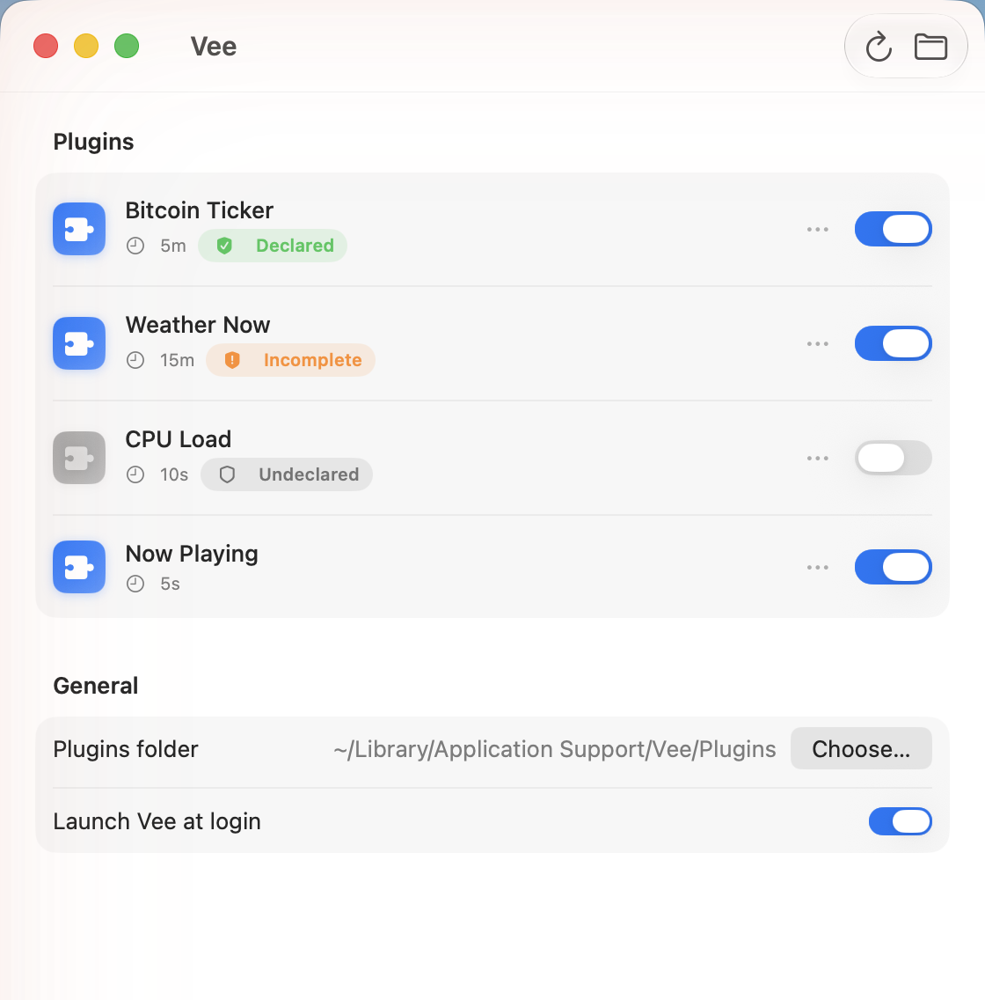
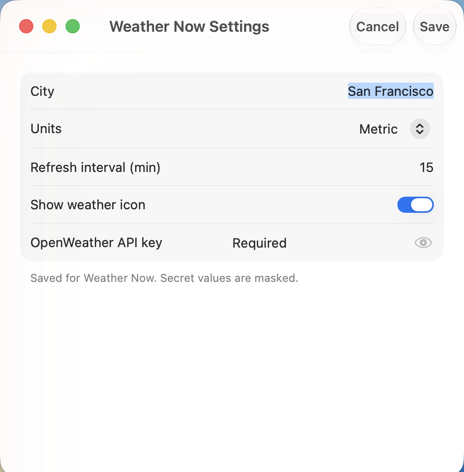
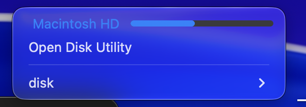

# Vee

[](https://github.com/navbytes/vee/releases) [-black?logo=apple)](#requirements) [](https://swift.org) [](LICENSE)

**A native, leak-free macOS menu-bar script runner — the modern successor to [xbar](https://github.com/matryer/xbar) and [SwiftBar](https://github.com/swiftbar/SwiftBar).**

> **Every xbar plugin. None of the memory leaks.** Run any script in your menu bar — and see what it touches before you install it.

Vee runs plugins — any executable, in any language — on a schedule and renders their standard output as menu-bar titles and dropdown menus. Your existing xbar/SwiftBar plugins run unchanged; Vee adds a native AppKit UI, a trust/transparency layer, a built-in plugin catalog, and typed SDKs (TypeScript, Python, Go).

<!-- Promo banner. -->


## Screenshots

|  |  |
|---|---|
|  |  |
| **Discover** — browse the catalog with trust chips and install in one click. | **Trust at install** — see a plugin's footprint in plain language before it runs. |
|  |  |
| **Plugin Manager** — enable, disable, and review every plugin's trust badges. | **Plugin settings** — typed forms from `<xbar.var>`; secrets masked in the Keychain. |
|  |  |
| **Native dropdown** — a Liquid Glass menu with an inline `progress=` gauge on live data. | **In the menu bar** — each plugin renders its own native status item. |

<sup>The bottom row is a real capture of the shipped build running on macOS 26.</sup>

## Why Vee

- **Native and leak-free** — pure Swift 6.2 / SwiftUI + AppKit (`NSStatusItem`/`NSMenu`), Liquid Glass UI, zero third-party dependencies. No embedded WebView in the menu; subprocess output is drained incrementally and processes are timed out and killed, so long-running use doesn't leak memory.
- **Runs the existing ecosystem** — the full xbar/SwiftBar plugin protocol (filename intervals, `---`/`--` menus, `|` params, `<xbar.*>`/`<swiftbar.*>` headers, SF Symbols, ANSI, Markdown, streaming, cron) works on day one.
- **Transparency, not a sandbox** — plugins run un-sandboxed by design (the model requires it), but they can **declare** what they touch via `<vee.*>` tags, and Vee shows a plain-language trust summary before install plus trust badges in the Manager. Advisory, never enforced.
- **Configuration belongs to the plugin** — `<xbar.var>` declarations become an auto-generated settings form; secret fields are masked and stored in the macOS Keychain. The app never hardcodes service names or credentials.
- **Discover** — a built-in browser over the shared [`matryer/xbar-plugins`](https://github.com/matryer/xbar-plugins) catalog, with trust chips and one-click install through the trust gate.
- **Optional typed SDK** — write plugins in TypeScript with `Menu`/`Section` builders; Node runs the `.ts` directly, no build step.

## Requirements

- macOS 26 or later
- Apple Silicon (arm64) — there is no Intel build

## Install

Vee is distributed Developer-ID-signed and **notarized**, outside the Mac App Store (the App Store sandbox is incompatible with arbitrary plugin execution).

**Homebrew (recommended):**

```sh
brew tap navbytes/vee https://github.com/navbytes/vee
brew install --cask vee
```

`brew upgrade --cask vee` picks up new releases automatically.

**Or download directly:**

1. Download the latest `Vee.app` from [GitHub Releases](https://github.com/navbytes/vee/releases).
2. Drag it into `/Applications`.
3. Launch it. On first launch, if Gatekeeper prompts, right-click `Vee.app` → **Open** and confirm.

## Quick start — your first plugin

Plugins live in `~/Library/Application Support/Vee/plugins` by default (Vee creates this folder on first launch; change it in the Plugin Manager → **Choose Folder**). A plugin's filename encodes its refresh interval: `name.INTERVAL.ext`.

Create the folder if you haven't launched Vee yet, then add `hello.5s.sh`:

```sh
mkdir -p ~/Library/Application\ Support/Vee/plugins
```

```sh
#!/bin/bash
echo "Hello 👋"
echo "---"
echo "It works!"
echo "Refresh | refresh=true"
```

Make it executable:

```sh
chmod +x ~/Library/Application\ Support/Vee/plugins/hello.5s.sh
```

The `.5s` runs it every 5 seconds. The line before `---` is the menu-bar title; everything after is the dropdown. Full reference: **[Plugin authoring](docs/_content/plugin-authoring.md)**.

## Migrating from SwiftBar / xbar

Point Vee at your existing plugins folder (Plugin Manager → **Choose Folder**) — that's the whole migration. The entire xbar/SwiftBar protocol is supported, and Vee injects the same environment variables (`XBARDarkMode`, `SWIFTBAR_*`, `OS_*`), so plugins run unchanged. Caveats: macOS 26+ and Apple Silicon only. See **[Migrating from SwiftBar/xbar](docs/_content/migrating-from-swiftbar.md)**.

## Features

- xbar/SwiftBar-compatible plugin format (titles, submenus, `|` params, metadata headers)
- Filename refresh intervals (`ms`/`s`/`m`/`h`/`d`) and `<swiftbar.schedule>` cron
- SF Symbols, ANSI color, inline Markdown, emoji shortcodes
- Streaming plugins (`~~~`) with restart/backoff
- Declared typed preferences → auto-generated forms; secrets in the Keychain
- `<vee.*>` trust declarations → plain-language trust summary + badges
- Discover: catalog browser with one-click, trust-gated install
- Plugin Manager: enable/disable, per-plugin settings, reveal in Finder, choose folder, launch-at-login, refresh all
- `vee://` and `swiftbar://` URL actions
- Zero-dependency typed SDKs (TypeScript, Python, Go) with golden-fixture drift guards

## Documentation

- [Getting started](docs/_content/getting-started.md)
- [Migrating from SwiftBar/xbar](docs/_content/migrating-from-swiftbar.md)
- [Plugin authoring reference](docs/_content/plugin-authoring.md)
- [Trust model](docs/_content/trust-model.md)
- [Preferences](docs/_content/preferences.md)
- [Plugin SDKs (TypeScript, Python, Go)](docs/_content/sdk.md)
- [JSON output format](docs/_content/json-output.md)
- [CLI and URL actions](docs/_content/cli-and-urls.md)
- [Architecture (for contributors)](ARCHITECTURE.md)
- [FAQ](docs/_content/faq.md)
- [Troubleshooting](docs/_content/troubleshooting.md)

## Writing plugins

A plugin is any executable that prints the xbar/SwiftBar format to stdout — bash, Python, Ruby, a compiled binary, anything. See the **[plugin authoring reference](docs/_content/plugin-authoring.md)** for the full format, and [`examples/`](examples/) for ready-to-run showcase plugins.

## Typed SDKs (TypeScript, Python, Go)

Prefer typed builders to hand-formatting text? Vee ships zero-dependency SDKs in three languages, each with `Menu`/`Section` builders and typed builders for the rich params (`sparkline`/`toggle`/`slider`/`progress`) so quoting and escaping are handled for you:

- **[TypeScript](docs/_content/sdk.md)** ([`plugins/`](plugins/)) — Node 24+ runs the `.ts` directly, no build step.
- **[Python](plugins/python/README.md)** ([`plugins/python/`](plugins/python/)) — standard library only.
- **[Go](plugins/go/README.md)** ([`plugins/go/`](plugins/go/)) — standard library only.

A golden-fixture drift guard shared byte-for-byte across all three keeps every SDK and the Swift parser in lockstep.

## Trust model

Vee runs plugins un-sandboxed with your privileges — a real sandbox would break the plugins people want to run, which is why apps in this category ship outside the App Store. Instead of pretending to isolate plugins, Vee makes them **transparent**: authors declare network domains, filesystem paths, secrets, and external binaries via `<vee.*>` tags, and Vee shows a plain-language summary before install and trust badges in the Manager. It's advisory, never enforced — read the source of anything you don't trust. Details: **[Trust model](docs/_content/trust-model.md)**.

## Build from source

```sh
swift build          # build the libraries + dev executable
swift test           # run the test suites
swift run vee        # run the menu-bar app for development

# Build the distributable app bundle:
xcodegen generate
xcodebuild -project Vee.xcodeproj -scheme Vee build
```

Repository layout:

```
Sources/
├─ VeeCore/         # primitives: RefreshInterval, PluginFilename, clock, errors
├─ VeePluginFormat/ # the xbar/SwiftBar output + header parser (pure)
├─ VeeRuntime/      # discovery, execution (leak-free), scheduling, streaming
├─ VeeMenu/         # ParsedOutput → NSMenu (colors, ANSI, SF Symbols, actions)
├─ VeePreferences/  # <xbar.var> stores + Keychain secrets
├─ VeeTrust/        # <vee.*> capability declarations → trust summaries
├─ VeeCatalog/      # xbar-plugins catalog client + installer
├─ VeeUI/           # SwiftUI settings + plugin-manager windows
├─ VeeApp/          # AppKit shell: status items, coordinators, app delegate
└─ vee/             # executable entry point
plugins/            # TypeScript plugin SDK + examples + golden fixtures
```

## Contributing & license

Contributions are welcome — see [CONTRIBUTING.md](CONTRIBUTING.md). Vee is open source under the [MIT License](LICENSE).
