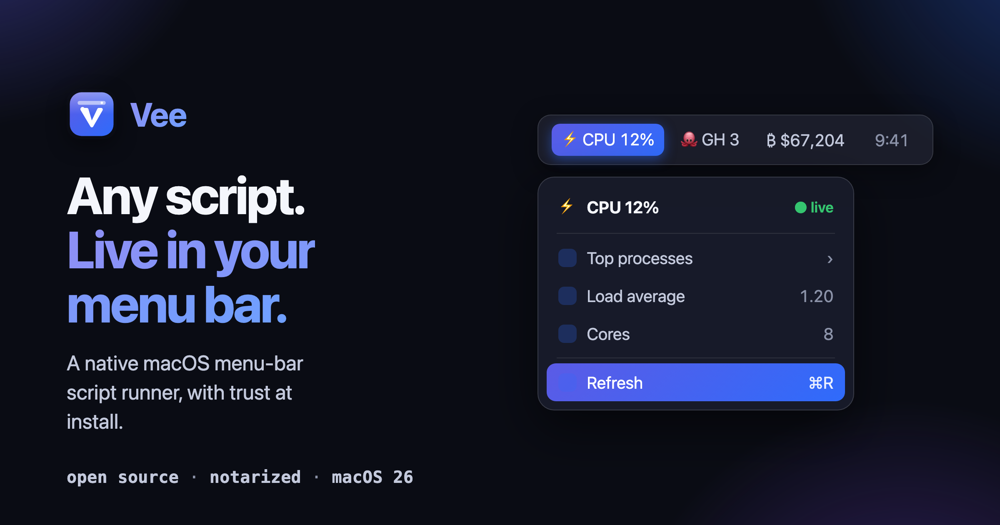

# Vee

[](https://github.com/navbytes/vee/releases) [-black?logo=apple)](https://vee.navbytes.io/guide/getting-started/) [](https://swift.org) [](LICENSE)

**A native, leak-free macOS menu-bar script runner.**

Vee runs plugins — any executable, in any language — on a schedule and renders
their stdout natively. One script can be a menu-bar item, a Notification Center
widget, a searchable panel, and a window on your desktop; rows pick their own
surfaces with `visibleOn=`. AppKit throughout, no WebView, no third-party
dependencies, and a plain-language trust summary that shows what a plugin
touches before you install it. Existing xbar and SwiftBar plugins run
unchanged.

📖 **[Documentation](https://vee.navbytes.io/guide/getting-started/)** · 🌐 **[vee.navbytes.io](https://vee.navbytes.io)**



## Install

macOS 26+ on Apple Silicon. Developer-ID-signed and notarized. One binary is
both the menu-bar app and the `vee` CLI, so installing gets you both.

```sh
brew install --cask navbytes/tap/vee
```

Or without Homebrew:

```sh
curl -fsSL https://vee.navbytes.io/install.sh | bash
```

Other routes (direct download, `mise` for the CLI only) and the installer's
options: **[Getting started](https://vee.navbytes.io/guide/getting-started/)**.

## Your first plugin

A plugin's filename encodes its refresh interval — `name.INTERVAL.ext`. Drop
`hello.5s.sh` into `~/Library/Application Support/Vee/plugins`:

```sh
#!/bin/bash
echo "Hello 👋"
echo "---"
echo "It works!"
echo "Refresh | refresh=true"
```

`chmod +x` it. The line above `---` is the menu-bar title; everything below is
the dropdown. Full reference: **[Plugin authoring](https://vee.navbytes.io/guide/plugin-authoring/)**.

Already have xbar or SwiftBar plugins? Point Vee at your existing folder
(Plugin Manager → **Choose Folder**) — that is the whole migration.

## Documentation

| | |
|---|---|
| [Getting started](https://vee.navbytes.io/guide/getting-started/) | Install, first plugin, the basics. |
| [Plugin authoring](https://vee.navbytes.io/guide/plugin-authoring/) | The full text protocol: params, submenus, headers, surface targeting (`visibleOn=`), streaming, cron. |
| [JSON output](https://vee.navbytes.io/guide/json-output/) | The recommended format for new plugins — typed, no `\|`-quoting. |
| [Plugin SDKs](https://vee.navbytes.io/guide/sdk/) | Zero-dependency TypeScript, Python, and Go builders. |
| [Rich params & charts](https://vee.navbytes.io/guide/charts/) | `progress=`, `sparkline=`, pie/donut/stacked-bar, `toggle=`, `slider=`. |
| [Widgets](https://vee.navbytes.io/guide/widgets/) | Notification Center tiles and the Vee Health roll-up. |
| [Preferences](https://vee.navbytes.io/guide/preferences/) | Declared plugin variables become typed settings forms; secrets in the Keychain. |
| [Trust model](https://vee.navbytes.io/guide/trust-model/) | `<vee.*>` declarations and the install-time trust summary. |
| [CLI & URL actions](https://vee.navbytes.io/guide/cli-and-urls/) | `vee render`, `vee lint`, `vee dev`, `vee new`, `vee://`. |
| [Migrating from SwiftBar/xbar](https://vee.navbytes.io/guide/migrating-from-swiftbar/) | What carries over, and what does not. |
| [Custom plugin stores](https://vee.navbytes.io/guide/enterprise-store/) | Run Discover against your own catalog, signed and pinned. |
| [Troubleshooting](https://vee.navbytes.io/guide/troubleshooting/) · [FAQ](https://vee.navbytes.io/guide/faq/) | When something does not work. |
| [Architecture](ARCHITECTURE.md) · [Contributing](CONTRIBUTING.md) | For contributors. |

If `vee.navbytes.io` is blocked on your network, the same docs are mirrored at
**[vee-docs.pages.dev](https://vee-docs.pages.dev/)**.

Ready-to-run examples live in [`plugins/showcase/`](plugins/showcase/) —
including [`kitchen-sink.1m.sh`](plugins/showcase/kitchen-sink.1m.sh), one file
exercising every JSON field.

## Build from source

```sh
swift build && swift test
swift run vee                   # run the menu-bar app for development
```

The distributable bundle is `xcodegen generate && xcodebuild -project Vee.xcodeproj -scheme Vee build`.
Module layout and design notes: [ARCHITECTURE.md](ARCHITECTURE.md).

## Contributing & license

Contributions are welcome — see [CONTRIBUTING.md](CONTRIBUTING.md). Vee is open
source under the [MIT License](LICENSE).
